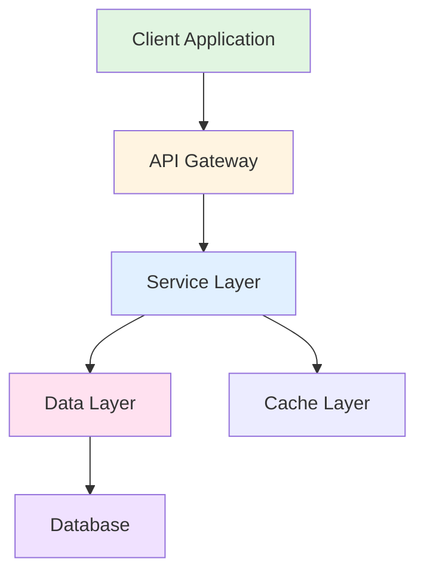
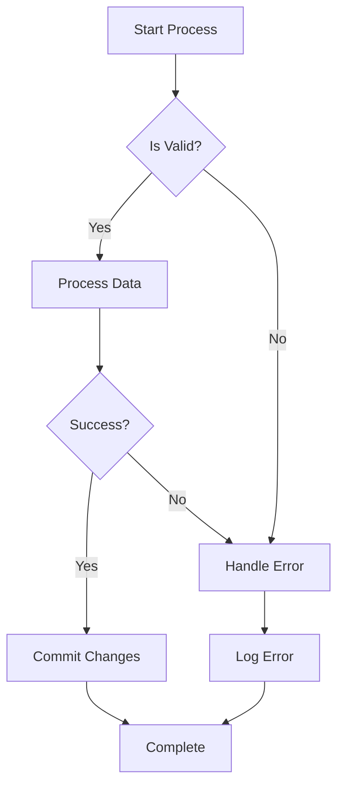
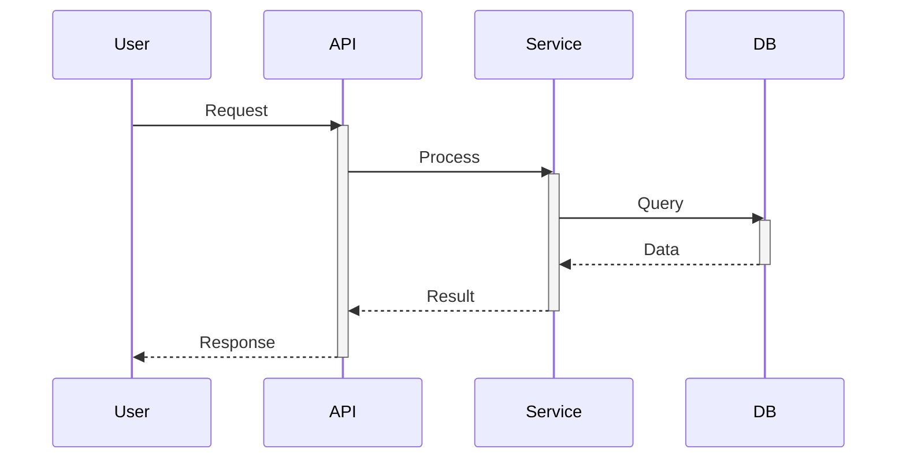
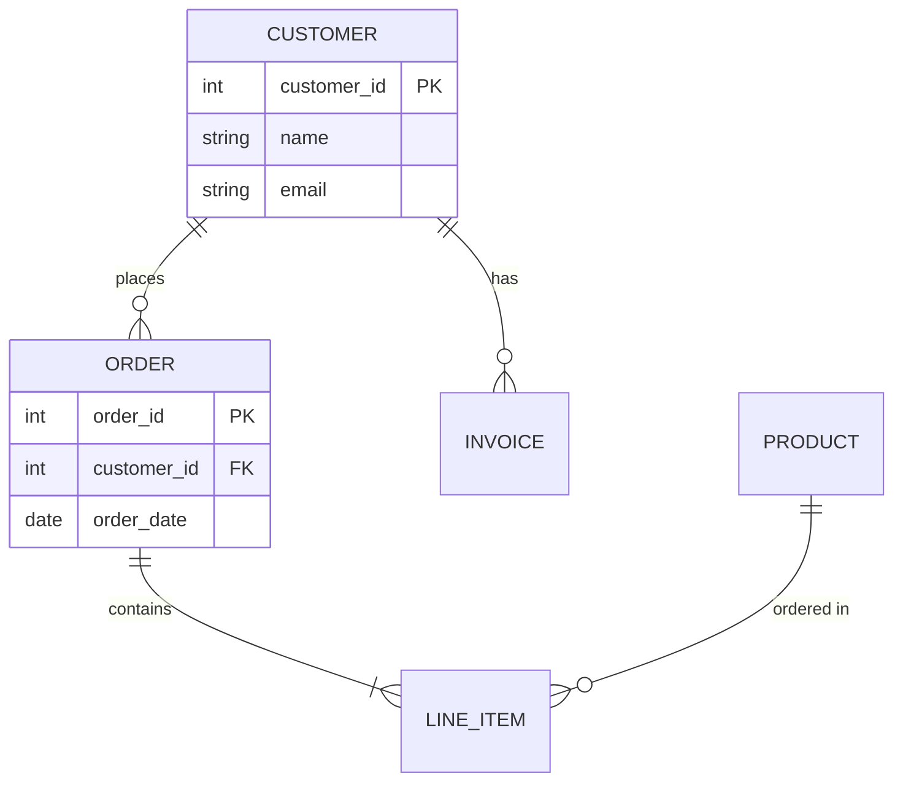

# Mermaid Diagrams Skill

## Overview

This skill specializes in generating, optimizing, and refining Mermaid diagrams for enterprise technical documentation and visual communication. It covers all major diagram types with best practices for clarity, maintainability, and professional presentation.

## Core Competencies

### Diagram Types Mastery

**Flowcharts & Graphs**
- Flowchart syntax with conditional logic (if/else/switch)
- Node shapes: rectangles, diamonds, circles, rectangles with rounded corners
- Arrow styling and labels
- Subgraph nesting for hierarchical visualization
- Complex multi-branch decision trees

**Sequence Diagrams**
- Actor and participant definitions
- Message sequences with synchronous/asynchronous calls
- Activation boxes and lifelines
- Parallel processing, alt/else conditionals
- Loop, break, par, critical, neg, strict, seq, neg constructs
- Error handling and exception flows
- Autonumber for message sequencing

**Class Diagrams**
- Class definitions with attributes and methods
- Inheritance, composition, aggregation relationships
- Interface implementation
- Visibility modifiers (public, private, protected)
- Abstract classes and methods
- Cardinality and multiplicity notation

**Entity-Relationship (ER) Diagrams**
- Entity definitions with attributes
- Relationship types: one-to-one, one-to-many, many-to-many
- Primary and foreign key indication
- Database schema visualization
- Cardinality notation (|o, ||, }o, }|)

**State Diagrams**
- State definitions and transitions
- Entry/exit actions
- Compound states and substates
- Parallel states
- Fork and join points
- Choice pseudostates

**Gantt Charts**
- Task scheduling and timeline visualization
- Milestone markers
- Task dependencies with arrows
- Section grouping
- Critical path highlighting

**User Journey Diagrams**
- Actor sections
- Task sequences with emotional/importance ratings
- Section organization
- Timeline representation

**C4 Diagrams**
- System context diagrams
- Container diagrams
- Component diagrams
- Code/Class diagrams
- System landscape views

**Pie Charts & Bar Charts**
- Simple data visualization
- Label and value pairs
- Category grouping
- Percentage representation

**Mind Maps**
- Hierarchical idea visualization
- Multi-level branching
- Concept mapping

**Timeline Diagrams**
- Historical and chronological visualization
- Event sequencing
- Milestone marking

**Git Graphs**
- Branch visualization
- Commit history representation
- Merge and rebase operations

## Best Practices

### Syntax Excellence
- Always use consistent indentation (2 or 4 spaces)
- Employ descriptive node/actor/entity names (camelCase or snake_case)
- Use meaningful labels on connectors and relationships
- Comment complex sections with %% for clarity
- Escape special characters in text when necessary

### Clarity & Maintainability
- Keep diagrams focused on single concept (one responsibility)
- Use subgraphs to organize related elements
- Limit diagram complexity—split into multiple diagrams if >30 nodes
- Provide context with descriptive titles
- Use consistent color schemes for semantic meaning
- Apply shapes intentionally (diamonds for decisions, circles for states)

### Performance Optimization
- Minimize nesting depth for faster rendering
- Use simplified notation where possible
- Avoid extremely long text labels—consider abbreviations with legend
- Test diagrams in target environment (markdown renderer, documentation site)
- Validate syntax before committing to avoid runtime errors

### Documentation Integration
- Embed diagrams in markdown files with ```mermaid code blocks
- Provide alternative text descriptions for accessibility
- Link diagrams to corresponding documentation sections
- Version control diagram changes alongside code updates
- Use consistent diagram style across documentation

## Common Patterns & Templates

### System Architecture Pattern


### Workflow Decision Tree Pattern


### Sequence Interaction Pattern


### Data Model Pattern


## Configuration & Rendering

### Theme & Styling
- Default theme: clean, professional appearance
- Available themes: default, dark, neutral, forest
- Custom CSS styling with `%%{init: {...}}%%` at start
- Background colors, font families, line styles customizable
- Responsive scaling for different viewport sizes

### Common Configuration


### Integration Environments
- GitHub Markdown (.md files)
- GitLab Wiki and Markdown
- Confluence with Mermaid plugin
- Docusaurus documentation
- Jekyll static sites
- Notion databases
- VS Code with Mermaid extension
- Online editors: mermaid.live, mermaidchart.com

## Advanced Techniques

### Accessibility
- Use descriptive labels for all elements
- Provide textual descriptions alongside diagrams
- Ensure sufficient color contrast
- Don't rely solely on color to convey meaning
- Include alt text in documentation context

### Complex Workflows
- Use subgraphs for logical grouping and swimlanes
- Implement error handling branches
- Represent parallel processing with explicit paths
- Include feedback loops for iterative processes

### Performance Optimization
- Simplify overly complex diagrams into multiple focused views
- Use clustering for large numbers of related nodes
- Avoid deeply nested subgraph structures
- Cache rendered diagrams when using dynamic generation

## Validation & Quality

### Syntax Validation
- Test diagrams before deployment using mermaid.live
- Use Mermaid CLI for batch validation: `mmdc -i diagram.mmd -o diagram.svg`
- Validate in target rendering environment
- Check for special character escaping issues

### Quality Checklist
- [ ] Diagram renders without errors
- [ ] All text labels are clear and concise
- [ ] Color scheme is meaningful and accessible
- [ ] Relationships and connections are logically correct
- [ ] Subgraphs organize complexity appropriately
- [ ] Documentation context explains diagram purpose
- [ ] Naming conventions are consistent
- [ ] No overlapping or ambiguous elements

## Common Pitfalls to Avoid

1. **Over-complexity**: Attempting to show too much in single diagram—use multiple focused diagrams
2. **Ambiguous labels**: Using vague text that doesn't clearly describe purpose
3. **Inconsistent styling**: Mixing different approaches without semantic meaning
4. **Special character issues**: Forgetting to escape quotes, brackets, or HTML entities
5. **Deeply nested subgraphs**: Reducing readability—flatten structure where possible
6. **Color-only differentiation**: Assuming color alone conveys meaning for accessibility
7. **Missing context**: Not providing explanatory text or titles
8. **Untested syntax**: Using unsupported diagram types or outdated syntax
9. **Poor performance**: Creating massive diagrams with 100+ nodes in single view
10. **Documentation drift**: Updating code but not updating corresponding diagrams

## Tools & Extensions

### Development Environment Integration
- VS Code: Mermaid Extension (Markdown Preview Mermaid Support)
- JetBrains IDEs: Mermaid plugin
- Online: mermaid.live (free editor with live preview)
- CLI: `npm install -g @mermaid-js/mermaid-cli`

### Export Options
- SVG (vector format, scalable)
- PNG (raster format, universal compatibility)
- PDF (for documents and presentations)
- Markdown (embeddable code blocks)

### Automation
- GitHub Actions for diagram validation
- CI/CD pipelines for converting .mmd files to images
- Documentation generation with auto-rendered diagrams

## Version Control & Maintenance

### File Organization
```
docs/
├── architecture/
│   ├── system-architecture.mmd
│   └── component-diagram.mmd
├── workflows/
│   ├── user-registration.mmd
│   └── payment-processing.mmd
├── data-models/
│   └── database-schema.mmd
└── README.md
```

### Commit Practices
- Commit .mmd source files to version control
- Generate images on-demand via CI/CD or pre-commit hooks
- Document diagram changes in commit messages
- Review diagram updates in pull requests like code changes

## Resources & References

**Official Documentation**: https://mermaid.js.org/
**Interactive Editor**: https://mermaid.live/
**Community Examples**: https://github.com/mermaid-js/mermaid
**Syntax Reference**: https://mermaid.js.org/syntax/flowchart.html

## Skill Activation

This skill activates when you:
- Request diagram creation or modification
- Ask for visualization of processes, systems, or relationships
- Need architecture documentation or technical diagrams
- Require flow chart, sequence, or data model generation
- Ask to convert descriptions into visual formats
- Need diagram syntax validation or optimization
- Request diagram type recommendations

Use `@mermaid-diagrams` to explicitly invoke this skill for any diagramming task requiring specialized Mermaid expertise.
