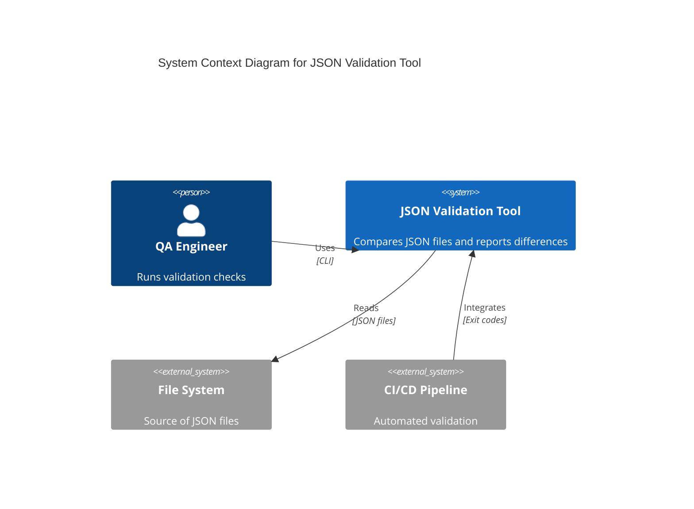
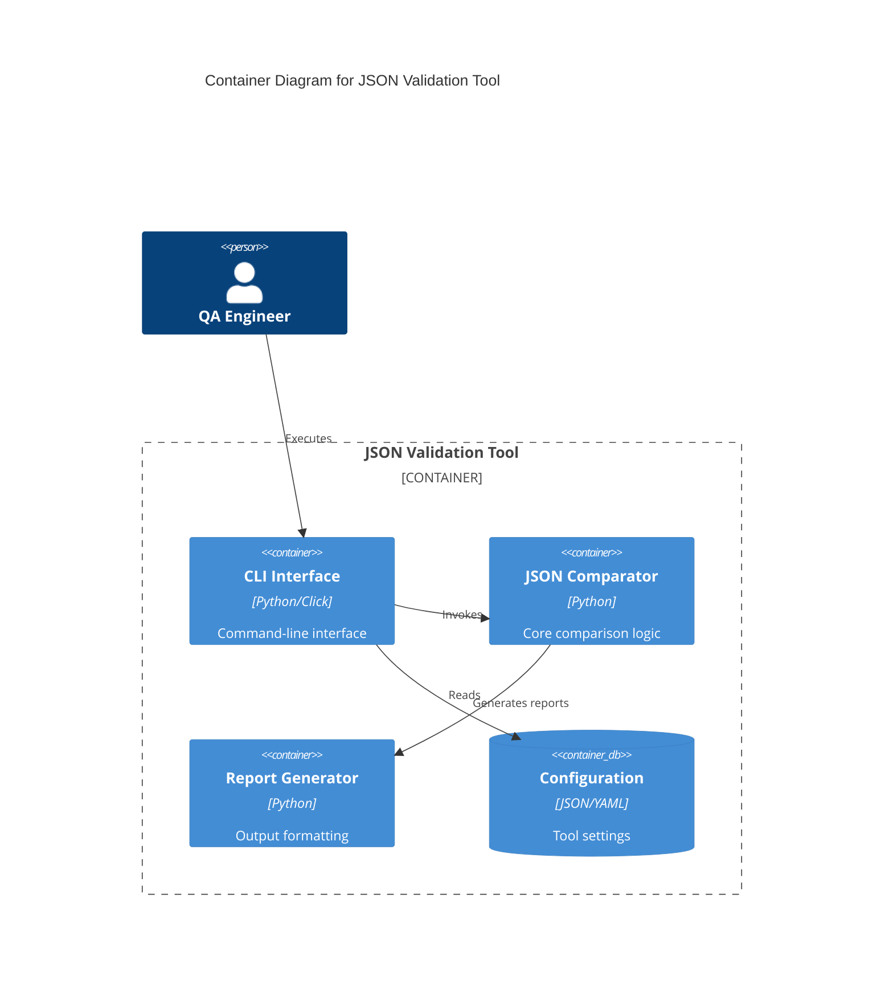
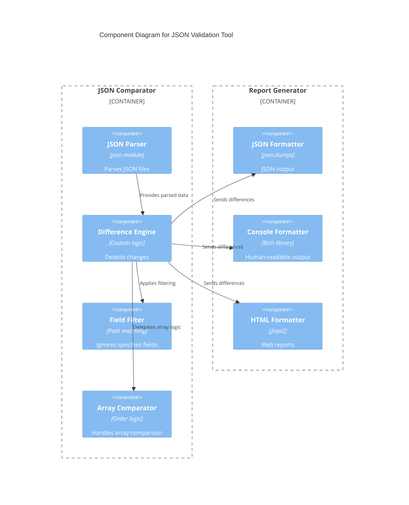
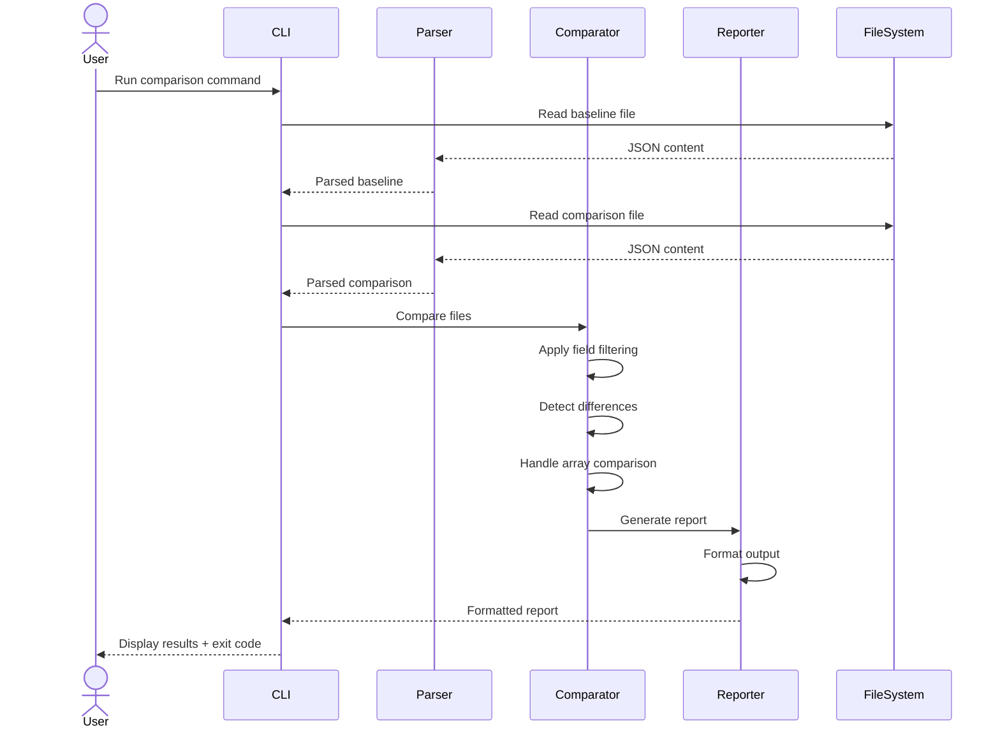
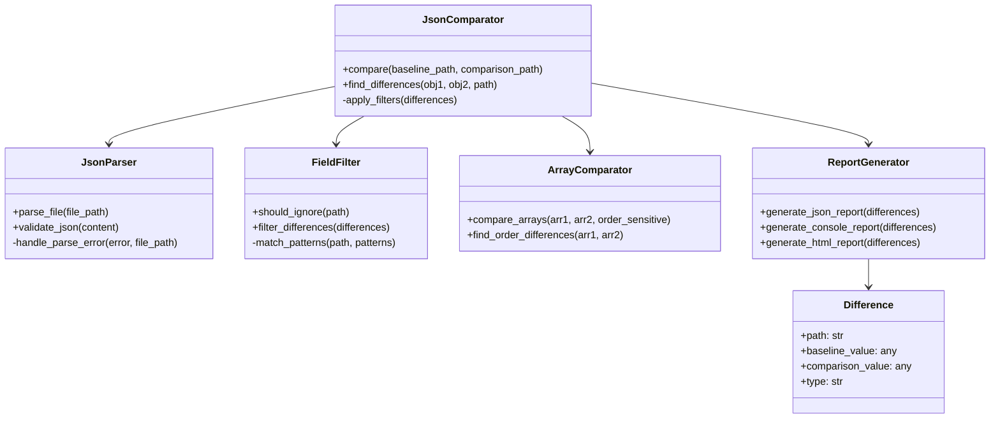

# Solution Design: JSON Validation Tool

**JIRA Ticket:** SCRUM-5  
**Author:** Solution Architect Agent  
**Date:** 6 December 2025

## Overview

### Problem Statement
In order to ensure the quality of the service API reflector, we need a Validation Tool to compare 2 sets of JSON files from different version of the systems. This tool will help identify structural differences, value changes, and ensure consistency across system versions.

### Solution Approach
Create a standalone Python CLI tool that can compare JSON files with configurable options for array comparison, field ignoring, and multiple output formats. The tool will provide detailed difference reports and exit codes for CI/CD integration.

### Key Requirements from JIRA
- Compare two JSON files (baseline vs comparison)
- Detect structural differences (added/removed fields)
- Detect value differences with path information
- Handle nested JSON objects and arrays
- Support order-sensitive and order-insensitive array comparison
- Handle missing files gracefully with appropriate error codes
- Support ignoring specified fields during comparison
- Handle large JSON files efficiently (10,000 records within 30 seconds)
- Generate reports in JSON, console, and HTML formats
- Support batch comparison of multiple file pairs
- Handle mismatched file sets in directories

## System Architecture

### C4 Context Diagram

### C4 Container Diagram

### C4 Component Diagram

### Sequence Diagram

## Component Design

### New Components

#### JsonComparator
- **Responsibility:** Core comparison logic between two JSON structures
- **Dependencies:** JsonParser, FieldFilter, ArrayComparator, ReportGenerator
- **Key Methods:**
  - `compare(baseline, comparison)`: Main comparison method
  - `find_differences(obj1, obj2, path)`: Recursive difference detection
  - `apply_filters(differences)`: Remove ignored fields

#### JsonParser
- **Responsibility:** Parse JSON files with error handling
- **Dependencies:** Python json module
- **Key Methods:**
  - `parse_file(file_path)`: Load and parse JSON file
  - `validate_json(content)`: Check JSON syntax

#### FieldFilter
- **Responsibility:** Filter out specified fields from comparison
- **Dependencies:** fnmatch for pattern matching
- **Key Methods:**
  - `should_ignore(path)`: Check if path matches ignore patterns
  - `filter_differences(differences)`: Remove ignored differences

#### ArrayComparator
- **Responsibility:** Handle array comparison with order sensitivity
- **Dependencies:** difflib for sequence comparison
- **Key Methods:**
  - `compare_arrays(arr1, arr2, order_sensitive)`: Compare arrays
  - `find_order_differences(arr1, arr2)`: Detect order changes

#### ReportGenerator
- **Responsibility:** Generate reports in multiple formats
- **Dependencies:** jinja2 for HTML, rich for console
- **Key Methods:**
  - `generate_json_report(differences)`: JSON format
  - `generate_console_report(differences)`: Human-readable format
  - `generate_html_report(differences)`: Web format

### Modified Components

#### CLI Interface (New)
- **Changes Needed:** Create new CLI module using Click framework
- **Reason:** Provide user-friendly command-line interface
- **Impact:** None (new component)

## Data Model

### Class Diagram

## Implementation Notes

### Backend Changes
- **New Modules:**
  - `json_validator/core/comparator.py` - Main comparison logic
  - `json_validator/core/parser.py` - JSON parsing
  - `json_validator/core/filter.py` - Field filtering
  - `json_validator/core/array_comparator.py` - Array handling
  - `json_validator/reporting/generator.py` - Report generation
  - `json_validator/cli/main.py` - CLI interface
- **Dependencies:** click, jinja2, rich, pyyaml
- **Configuration:** YAML config for ignore patterns, output formats

### Performance Considerations
- **Memory Usage:** Stream processing for large files (>500MB limit)
- **Time Complexity:** O(n) for structural comparison, O(n log n) for array sorting
- **Expected SLA:** <30 seconds for 10,000 record files
- **Optimization:** Lazy loading, early termination on first difference if needed

### Error Handling
- **File Errors:** Missing files, permission issues, invalid JSON
- **Exit Codes:** 0 (no differences), 1 (differences found), 2 (errors)
- **Error Messages:** Clear, actionable error descriptions with line numbers

## Architecture Decisions

### Decision 1: Standalone Tool vs Library Integration
- **Context:** Tool could be integrated into MCP server or standalone
- **Decision:** Create as standalone CLI tool
- **Rationale:** Reusability across different projects, easier testing, clear separation of concerns
- **Alternatives Considered:** Integrate into JIRA MCP server, create as Python library
- **Consequences:** Additional packaging effort, but better modularity

### Decision 2: Multiple Output Formats
- **Context:** Different stakeholders need different report formats
- **Decision:** Support JSON, console, and HTML outputs
- **Rationale:** JSON for automation, console for human reading, HTML for sharing
- **Alternatives Considered:** Single format, plugin architecture
- **Consequences:** Increased complexity but better usability

### Decision 3: Array Comparison Modes
- **Context:** Arrays may or may not be order-sensitive
- **Decision:** Support both order-sensitive and order-insensitive modes
- **Rationale:** Flexibility for different data types (logs vs configurations)
- **Alternatives Considered:** Always order-sensitive, always order-insensitive
- **Consequences:** More complex logic but covers all use cases

## Risk Assessment

### Breaking Changes
- **Risk:** None (new tool)
- **Mitigation:** Comprehensive testing before release

### Performance Impact
- **Expected Metrics:**
  - Memory: <500MB for large files
  - Time: <30 seconds for 10k records
- **Load Testing Plan:** Test with various file sizes and structures

### Team Coordination
- **Dependencies:** None
- **Communication Plan:** Demo to QA team, documentation
- **Timeline:** 2 weeks development, 1 week testing

### Security Considerations
- **Input Validation:** JSON parsing with size limits
- **File Access:** Read-only operations, no network calls
- **Data Protection:** No sensitive data handling

## Implementation Plan

### Phase 1: Core Comparison (Week 1)
- [ ] Implement JsonParser with error handling
- [ ] Create basic JsonComparator for structural differences
- [ ] Add unit tests for core functionality
- [ ] Implement exit codes and basic CLI

### Phase 2: Advanced Features (Week 2)
- [ ] Add FieldFilter for ignoring fields
- [ ] Implement ArrayComparator with order modes
- [ ] Create ReportGenerator with JSON output
- [ ] Add console and HTML formatters

### Phase 3: Polish and Testing (Week 3)
- [ ] Add batch comparison for directories
- [ ] Implement performance optimizations
- [ ] Comprehensive test suite (>80% coverage)
- [ ] Documentation and examples

### Phase 4: Integration (Week 4)
- [ ] Package as Python package
- [ ] Create setup.py and requirements.txt
- [ ] Integration testing with CI/CD
- [ ] User acceptance testing

## Testing Strategy
- **Unit Tests:** Core comparison logic, parsing, filtering
- **Integration Tests:** End-to-end file comparison scenarios
- **Performance Tests:** Large file handling, memory usage
- **Edge Case Tests:** Invalid JSON, missing files, empty files

## Documentation Requirements
- **README:** Installation, usage examples, configuration
- **API Docs:** Class and method documentation
- **Examples:** Sample JSON files and comparison outputs

## JIRA Comments Summary

### Key Discussions
- No comments in the ticket

### Open Questions
- Should the tool support recursive directory comparison?
- What are the exact performance requirements for large files?
- Should HTML reports include interactive features?

## References
- **JIRA Ticket:** https://joeycmlam-1762529818344.atlassian.net/browse/SCRUM-5
- **Requirements:** SCRUM-5-json-validation-tool.feature (attached)
- **Related:** Service API reflector quality assurance