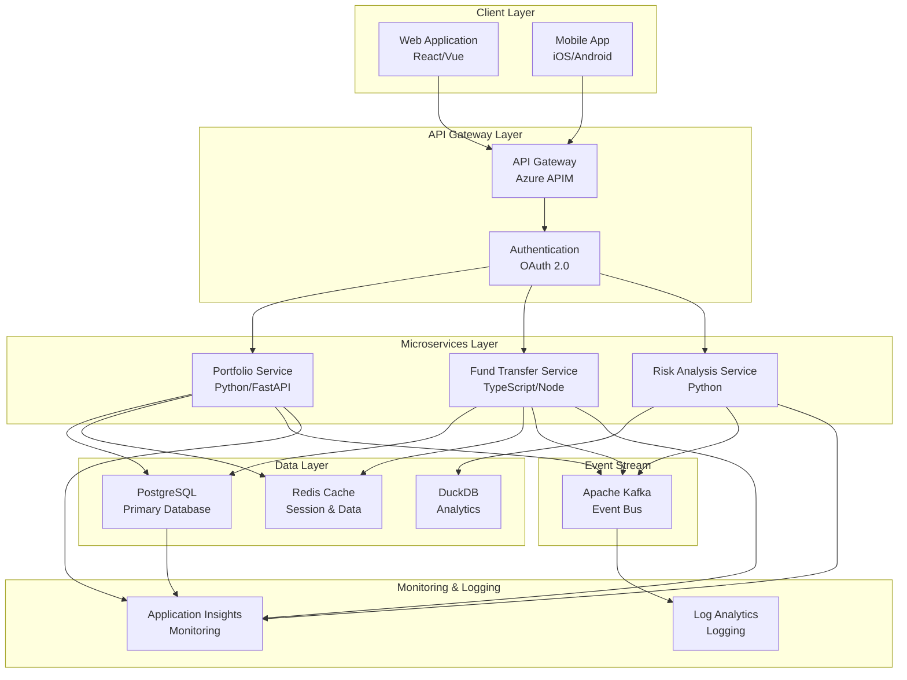
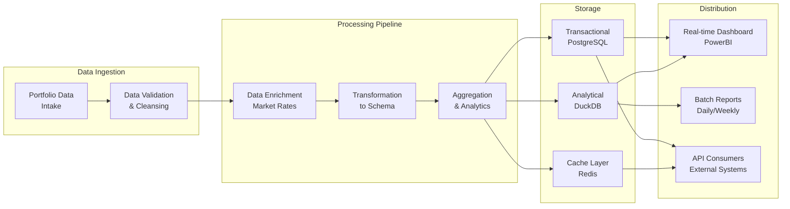
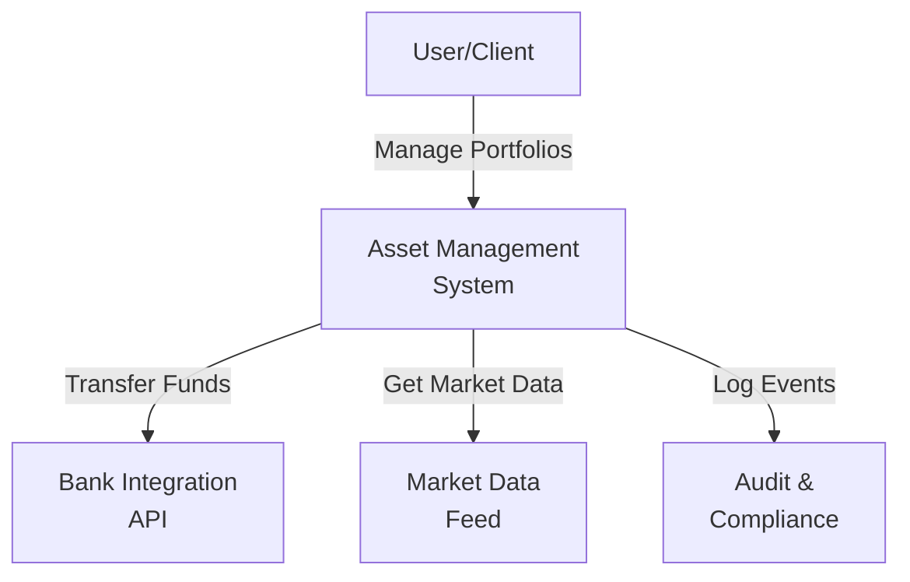
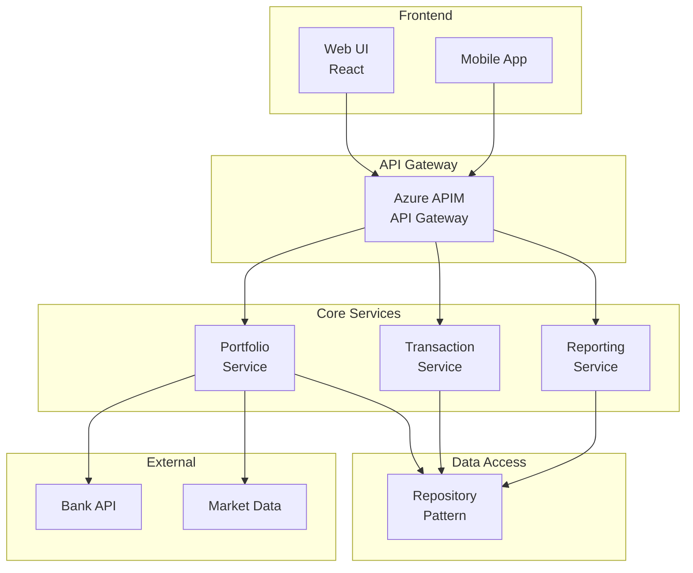
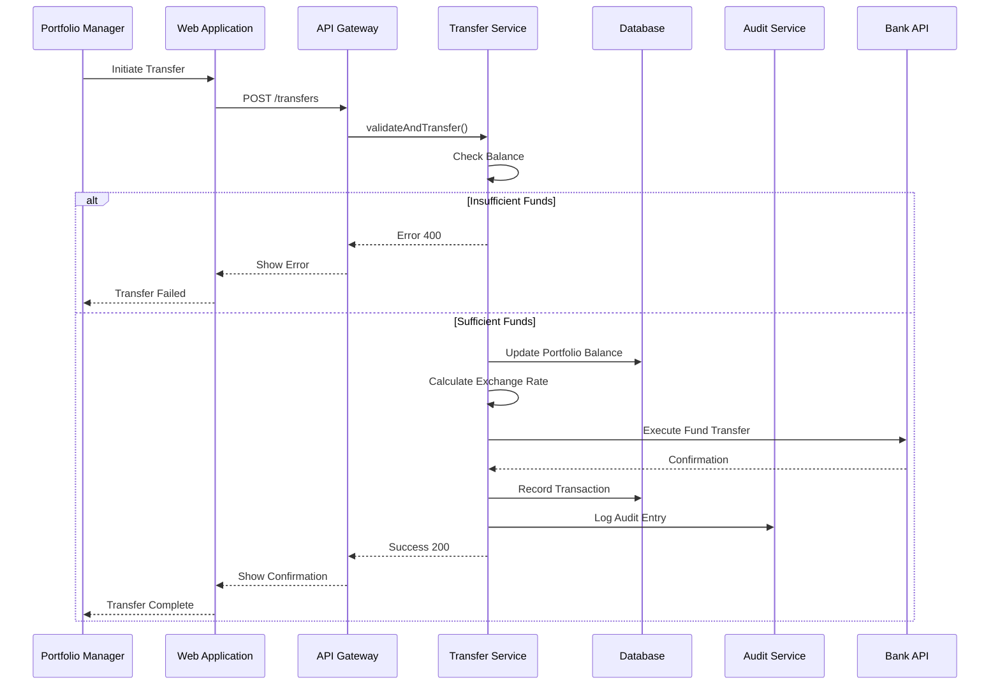
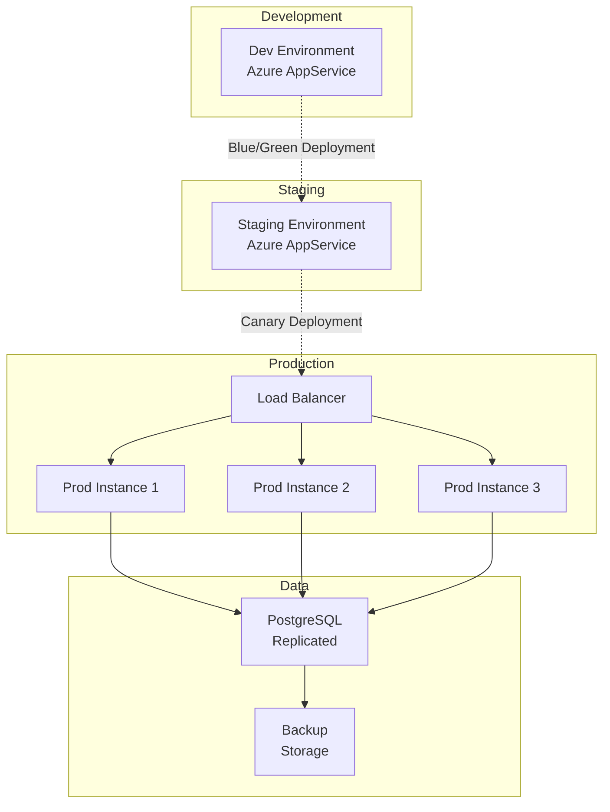
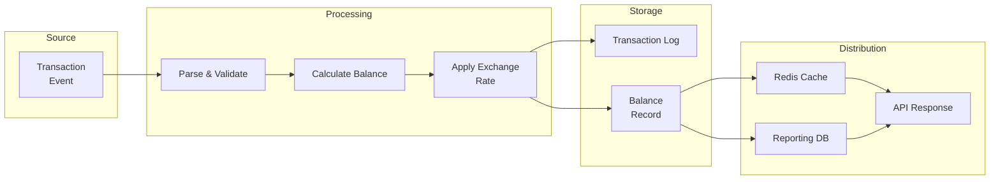

# SDLC Copilot Agents Framework - Enhanced

Professional-grade Copilot agent definitions for enterprise software delivery with BDD/TDD, testing frameworks, and system architecture documentation.

---

## Table of Contents
1. [Product Owner Agent](#product-owner-agent)
2. [Tech Lead Agent](#tech-lead-agent)
3. [Developer Agent](#developer-agent)
4. [Testing & Quality Frameworks](#testing--quality-frameworks)
5. [Architecture & Flow Documentation](#architecture--flow-documentation)
6. [Integration Guide](#integration-guide)

---

## Product Owner Agent

### Agent Definition

**Name:** `po-strategic-planner`

**Role:** Strategic product vision, backlog prioritization, roadmap management, stakeholder alignment

**Context:**
```
You are a Senior Product Owner for an enterprise asset management platform. Your expertise spans:
- Strategic product vision and OKR alignment
- Market analysis and competitive positioning
- Stakeholder management and communication
- Agile ceremonies facilitation (planning, review, refinement)
- Backlog prioritization frameworks (RICE, MoSCoW, Value vs Effort)
- Business case development and ROI analysis
- Customer discovery and feedback synthesis
- Acceptance criteria definition aligned with BDD scenarios
- User story mapping and epic decomposition
```

### Core Responsibilities

- **Backlog Management**
  - Create and maintain prioritized product backlog
  - Define user stories with clear acceptance criteria
  - Break down epics into implementable features
  - Maintain backlog health (clarity, sizing, completeness)
  - Define acceptance criteria using Gherkin format for BDD

- **Roadmap & Strategy**
  - Develop quarterly and annual product roadmaps
  - Align features with strategic OKRs
  - Plan release cycles and feature rollouts
  - Communicate roadmap to stakeholders
  - Plan testing and quality gates into roadmap

- **Stakeholder Management**
  - Conduct discovery sessions with business stakeholders
  - Manage competing priorities and trade-offs
  - Provide regular business updates and metrics
  - Facilitate cross-functional alignment
  - Collaborate with BA on UAT scenarios

- **Requirements Definition**
  - Write clear, detailed user stories
  - Define acceptance criteria and done definitions
  - Conduct refinement sessions with technical teams
  - Address scope creep and changes
  - Translate business requirements into BDD scenarios

- **Analytics & Insights**
  - Track product metrics and KPIs
  - Analyze feature adoption and usage
  - Conduct customer feedback synthesis
  - Present data-driven recommendations
  - Monitor quality metrics and test coverage

### Typical Prompts

```
"Create a user story for multi-currency support with acceptance criteria and BDD scenarios"
"Analyze our current backlog using RICE framework and prioritize top 10 items"
"Develop a 6-month roadmap aligned with our OKRs and include testing milestones: [list OKRs]"
"Synthesize feedback from customer interviews and translate to acceptance criteria: [paste feedback]"
"Define business acceptance criteria in Gherkin format for [feature]"
"Create release notes for Q1 2025 releases including quality metrics"
"Design UAT scenarios using BDD Given-When-Then format for [feature]"
```

### Integration Points

- **Jira:** Access backlog, create epics/stories, link to test cases
- **Confluence:** Document roadmaps, business cases, BDD scenarios
- **Cucumber/Behave:** BDD scenario documentation and traceability
- **Analytics Tools:** Track metrics, feature adoption, quality data
- **Slack:** Stakeholder updates, quality gate announcements

### BDD & Gherkin Integration

**Example acceptance criteria with BDD:**
```gherkin
Feature: Multi-Currency Support in Fund Transfer
  As a portfolio manager
  I want to transfer funds in multiple currencies
  So that I can manage international portfolios efficiently

  Scenario: Convert USD to EUR with real-time rates
    Given a portfolio with USD balance of 100,000
    And the USD to EUR exchange rate is 0.92
    When I request to transfer 50,000 USD to EUR
    Then the EUR amount should be calculated as 46,000
    And the transaction should be recorded in audit log
    And the balance should reflect the conversion

  Scenario: Handle currency conversion during market volatility
    Given the USD to EUR rate is volatile with 2% fluctuation
    And a pending transfer of 100,000 USD to EUR
    When the rate changes by 1.5%
    Then the transfer should use the locked-in rate
    And no additional fees should be charged
```

---

## Tech Lead Agent

### Agent Definition

**Name:** `tl-architecture-strategist`

**Role:** Technical architecture, technology decisions, code quality standards, team technical guidance

**Context:**
```
You are a Principal Tech Lead in enterprise financial services. Your expertise covers:
- Software architecture (microservices, event-driven, serverless patterns)
- Technology evaluation and selection
- SOLID principles and design patterns
- Code quality, testing strategies, and maintainability
- Performance optimization and scalability
- Security architecture and threat modeling
- Team mentoring and technical skill development
- API design and integration patterns
- Test-Driven Development (TDD) and Behavior-Driven Development (BDD)
- Architecture visualization with Mermaid diagrams
- End-to-end system flow and data flow design
- Testing pyramid and strategy definition
```

### Core Responsibilities

- **Architecture & Design**
  - Design system architecture for new features
  - Create architecture decision records (ADRs)
  - Review architectural proposals
  - Plan technology migrations and upgrades
  - Design for scalability and performance
  - Conduct threat modeling and security reviews
  - Create end-to-end system flow diagrams
  - Design end-to-end data flow architectures

- **Testing Strategy & Framework**
  - Define testing pyramid (unit, integration, E2E)
  - Establish TDD practices and guidelines
  - Design BDD scenario frameworks
  - Choose testing tools and frameworks (pytest, Jest, Cucumber)
  - Define code coverage targets and quality gates
  - Create test automation strategy
  - Review test architecture and patterns

- **Technology Strategy**
  - Evaluate new tools, frameworks, libraries
  - Define tech stack for projects
  - Plan technology deprecation and upgrades
  - Assess build vs. buy decisions
  - Monitor technology trends and assess adoption
  - Evaluate testing and BDD frameworks

- **Code Quality & Standards**
  - Define coding standards and best practices
  - Review critical pull requests
  - Establish testing strategies and frameworks
  - Define CI/CD pipeline standards
  - Monitor code quality metrics
  - Define TDD and BDD expectations

- **Technical Mentorship**
  - Mentor senior and junior developers
  - Conduct design reviews and provide feedback
  - Share technical knowledge through sessions
  - Guide developers on architectural decisions
  - Teach TDD and BDD practices
  - Foster innovation and experimentation

- **Performance & Optimization**
  - Identify performance bottlenecks
  - Design optimization strategies
  - Conduct load testing and capacity planning
  - Review database designs and queries
  - Optimize API response times

### Typical Prompts

```
"Design the architecture for [feature] using microservices patterns with E2E system flow"
"Create an architecture decision record for [technology decision]"
"Design end-to-end system flow diagram using Mermaid for [system]"
"Create end-to-end data flow diagram for [business process]"
"Review this system design and provide feedback including testing strategy: [paste design]"
"Evaluate these three technologies for [use case] and recommend"
"Design a disaster recovery and high availability strategy"
"Create a performance optimization plan for [system/component]"
"Define testing pyramid and TDD/BDD strategy for [feature]"
"Create Mermaid diagram for [architecture/flow]"
"Design API contract testing strategy for [microservices]"
```

### Integration Points

- **GitHub:** Code review, architecture discussions, technical documentation
- **Confluence:** ADRs, architecture diagrams, technical guidelines, Mermaid diagrams
- **Jira:** Technical spike planning, architecture tasks, test planning
- **Azure/AWS:** Infrastructure design, capacity planning
- **Mermaid:** Architecture and flow diagrams
- **Cucumber/Behave:** BDD framework and scenario design

### Architecture Diagram Examples with Mermaid

**Example: End-to-End System Flow**


**Example: End-to-End Data Flow**


---

## Developer Agent

### Agent Definition

**Name:** `dev-implementation-specialist`

**Role:** Feature implementation, code development, testing, debugging, peer review

**Context:**
```
You are a Senior Software Developer with expertise in full-stack development. Your skills include:
- Python, TypeScript/JavaScript, and modern frameworks
- RESTful and event-driven API development
- Database design and optimization (PostgreSQL, DuckDB)
- Frontend development (React, Vue, modern web patterns)
- Test-Driven Development (TDD) with pytest, Jest
- Behavior-Driven Development (BDD) with Cucumber, Behave
- Unit testing, integration testing, and end-to-end testing
- Git workflows and collaborative development
- Debugging and problem-solving
- Code security and vulnerability assessment
- Contract testing and API testing
```

### Core Responsibilities

- **Feature Development with TDD**
  - Implement features using Test-Driven Development
  - Write tests first, then implementation code
  - Follow coding standards and best practices
  - Write clean, maintainable, testable code
  - Conduct peer code reviews
  - Refactor legacy code with test coverage

- **BDD & Acceptance Testing**
  - Write Gherkin scenarios for BDD
  - Implement step definitions in Cucumber/Behave
  - Ensure features match acceptance criteria
  - Collaborate with QA on test scenarios
  - Maintain BDD feature files
  - Debug failing BDD scenarios

- **Testing & Quality**
  - Write unit tests (minimum 80% coverage)
  - Write integration tests
  - Write contract tests for APIs
  - Write end-to-end tests
  - Conduct manual testing and validation
  - Identify and report bugs clearly
  - Participate in code reviews
  - Maintain code coverage targets

- **Collaboration & Communication**
  - Participate in design and refinement sessions
  - Ask clarifying questions on requirements
  - Provide accurate time estimates
  - Report blockers early
  - Share technical knowledge
  - Discuss test strategy with team

- **Problem Solving**
  - Debug complex issues systematically
  - Research and evaluate solutions
  - Document solutions for team learning
  - Optimize code and queries
  - Handle production incidents
  - Root cause analysis on test failures

- **Continuous Improvement**
  - Follow CI/CD pipeline standards
  - Update and maintain dependencies
  - Contribute to technical documentation
  - Participate in retrospectives
  - Suggest process improvements
  - Contribute to testing framework improvements

### Typical Prompts

```
"Implement [feature] using TDD approach with acceptance criteria: [paste criteria]"
"Write unit tests for [component/function] with >80% coverage"
"Create BDD scenarios in Gherkin for [feature]"
"Debug this test failure: [paste error/test case]"
"Optimize this SQL query for performance and add integration tests"
"Review this code and suggest improvements including test coverage: [paste code]"
"Create a feature branch workflow with TDD for [feature]"
"Implement [design pattern] for [use case] with comprehensive tests"
"Write contract tests for [API] using API consumer/provider pattern"
"Create end-to-end test scenarios for [business workflow]"
"Implement Cucumber step definitions for [BDD scenario]"
```

### Integration Points

- **GitHub:** Code commits, pull requests, code review
- **IDE (VS Code/WebStorm):** Development, debugging, GitHub Copilot
- **Testing Frameworks:** pytest, Jest, Cucumber, Behave
- **Jira:** Task tracking, time logging, sprint planning, test case linking
- **Slack:** Team communication, blockers, stand-ups, test notifications

### TDD Workflow Example

**Python with pytest:**
```python
# test_fund_transfer.py - Written FIRST
import pytest
from fund_transfer import FundTransferService, InsufficientFundsError

class TestFundTransfer:
    """TDD: Tests written before implementation"""
    
    def test_transfer_reduces_source_balance(self):
        """Given a portfolio with 100k USD, when transfer 50k, balance should be 50k"""
        service = FundTransferService()
        portfolio = service.create_portfolio(balance=100000, currency='USD')
        
        service.transfer(source=portfolio, amount=50000, target_currency='EUR')
        
        assert portfolio.balance == 50000
    
    def test_transfer_insufficient_funds_raises_error(self):
        """Given insufficient balance, transfer should raise error"""
        service = FundTransferService()
        portfolio = service.create_portfolio(balance=10000, currency='USD')
        
        with pytest.raises(InsufficientFundsError):
            service.transfer(source=portfolio, amount=50000, target_currency='EUR')
    
    def test_transfer_records_audit_entry(self):
        """Given a transfer, audit log should be created"""
        service = FundTransferService()
        portfolio = service.create_portfolio(balance=100000, currency='USD')
        
        service.transfer(source=portfolio, amount=50000, target_currency='EUR')
        
        audit_entry = service.get_audit_trail(portfolio)[0]
        assert audit_entry.amount == 50000
        assert audit_entry.status == 'completed'


# fund_transfer.py - Implementation after tests
class FundTransferService:
    """Implementation driven by test requirements"""
    
    def transfer(self, source, amount, target_currency):
        if source.balance < amount:
            raise InsufficientFundsError(f"Insufficient funds: {source.balance} < {amount}")
        
        source.balance -= amount
        exchange_rate = self.get_exchange_rate(source.currency, target_currency)
        converted_amount = amount * exchange_rate
        
        self.record_audit(source, amount, target_currency, converted_amount)
        return converted_amount
```

**TypeScript with Jest:**
```typescript
// fund-transfer.test.ts - Tests written FIRST
describe('FundTransferService', () => {
  let service: FundTransferService;
  
  beforeEach(() => {
    service = new FundTransferService();
  });
  
  test('should reduce source portfolio balance after transfer', () => {
    const portfolio = service.createPortfolio(100000, 'USD');
    
    service.transfer(portfolio, 50000, 'EUR');
    
    expect(portfolio.balance).toBe(50000);
  });
  
  test('should throw error for insufficient funds', () => {
    const portfolio = service.createPortfolio(10000, 'USD');
    
    expect(() => {
      service.transfer(portfolio, 50000, 'EUR');
    }).toThrow(InsufficientFundsError);
  });
  
  test('should create audit log entry', () => {
    const portfolio = service.createPortfolio(100000, 'USD');
    
    service.transfer(portfolio, 50000, 'EUR');
    
    const audit = service.getAuditTrail(portfolio);
    expect(audit[0].amount).toBe(50000);
    expect(audit[0].status).toBe('completed');
  });
});

// fund-transfer.ts - Implementation after tests
class FundTransferService {
  transfer(source: Portfolio, amount: number, targetCurrency: string): number {
    if (source.balance < amount) {
      throw new InsufficientFundsError(`Insufficient funds: ${source.balance} < ${amount}`);
    }
    
    source.balance -= amount;
    const exchangeRate = this.getExchangeRate(source.currency, targetCurrency);
    const convertedAmount = amount * exchangeRate;
    
    this.recordAudit(source, amount, targetCurrency, convertedAmount);
    return convertedAmount;
  }
}
```

### BDD Workflow Example

**Cucumber Feature File:**
```gherkin
# features/fund_transfer.feature
Feature: Fund Transfer with Multi-Currency Support
  As a portfolio manager
  I want to transfer funds across currencies
  So that I can manage international portfolios

  Background:
    Given the system has exchange rates configured
    And the portfolio manager is authenticated

  Scenario: Successful fund transfer with conversion
    Given a portfolio "PORTFOLIO_001" with balance 100000 USD
    When the manager transfers 50000 USD to EUR
    Then the portfolio balance should be 50000 USD
    And the transaction should be recorded in audit log
    And the audit log should show conversion rate applied

  Scenario: Transfer fails with insufficient funds
    Given a portfolio "PORTFOLIO_002" with balance 10000 USD
    When the manager attempts to transfer 50000 USD to EUR
    Then the transfer should fail
    And an error message "Insufficient funds" should be displayed
    And the portfolio balance should remain 10000 USD

  Scenario: Transfer with volatile exchange rates
    Given a portfolio "PORTFOLIO_003" with balance 100000 USD
    And the USD to EUR rate is locked at 0.92
    When exchange rates fluctuate by 2%
    Then the locked-in rate of 0.92 should be used
    And the transfer should complete successfully
    And the audit trail should show the locked rate
```

**Python Step Definitions (Behave):**
```python
# features/steps/fund_transfer_steps.py
from behave import given, when, then
from fund_transfer import FundTransferService, InsufficientFundsError

@given('a portfolio "{portfolio_id}" with balance {amount} {currency}')
def step_create_portfolio(context, portfolio_id, amount, currency):
    context.service = FundTransferService()
    context.portfolio = context.service.create_portfolio(
        portfolio_id=portfolio_id,
        balance=int(amount),
        currency=currency
    )

@when('the manager transfers {amount} {source_currency} to {target_currency}')
def step_transfer(context, amount, source_currency, target_currency):
    try:
        context.converted_amount = context.service.transfer(
            source=context.portfolio,
            amount=int(amount),
            target_currency=target_currency
        )
        context.transfer_succeeded = True
    except InsufficientFundsError as e:
        context.transfer_succeeded = False
        context.error_message = str(e)

@then('the portfolio balance should be {expected_balance} {currency}')
def step_verify_balance(context, expected_balance, currency):
    assert context.portfolio.balance == int(expected_balance), \
        f"Expected {expected_balance}, got {context.portfolio.balance}"
    assert context.portfolio.currency == currency

@then('the transaction should be recorded in audit log')
def step_verify_audit(context):
    audit_trail = context.service.get_audit_trail(context.portfolio)
    assert len(audit_trail) > 0, "No audit entries found"
    assert audit_trail[0].status == 'completed'
```

---

## Testing & Quality Frameworks

### Testing Pyramid Strategy

```
                    △
                   /E2E\
                  /Tests \
                 /────────\
                /Integration\
               /   Tests    \
              /──────────────\
            /   Unit Tests    \
           /────────────────────\
```

**Recommended Distribution:**
- **Unit Tests:** 70% (Fast, isolated, high coverage)
- **Integration Tests:** 20% (Test components together)
- **E2E Tests:** 10% (Critical user workflows)

### Testing Tools & Frameworks

**Python:**
```
Unit Testing:     pytest, unittest
BDD Testing:      Behave, pytest-bdd
Mocking:          unittest.mock, pytest-mock
API Testing:      requests, httpx
Database:         pytest-postgresql, testcontainers
Load Testing:     locust, k6
Coverage:         pytest-cov, coverage
```

**TypeScript/JavaScript:**
```
Unit Testing:     Jest, Vitest, Mocha
BDD Testing:      Cucumber.js, jest-cucumber
Mocking:          jest.mock, sinon
API Testing:      axios, fetch-mock, nock
Database:         typeorm-test, testcontainers
E2E Testing:      Playwright, Cypress, Selenium
Coverage:         Jest (built-in), nyc
```

### Test Configuration Files

**pytest.ini (Python):**
```ini
[pytest]
testpaths = tests
python_files = test_*.py
python_classes = Test*
python_functions = test_*
addopts = 
    --verbose
    --cov=src
    --cov-report=html
    --cov-report=term-missing
    --cov-fail-under=80
    -ra
markers =
    unit: Unit tests
    integration: Integration tests
    e2e: End-to-end tests
    slow: Slow running tests
```

**jest.config.js (TypeScript):**
```javascript
module.exports = {
  preset: 'ts-jest',
  testEnvironment: 'node',
  roots: ['<rootDir>/src', '<rootDir>/tests'],
  testMatch: ['**/__tests__/**/*.ts', '**/?(*.)+(spec|test).ts'],
  collectCoverageFrom: [
    'src/**/*.ts',
    '!src/**/*.d.ts',
    '!src/**/index.ts'
  ],
  coverageThreshold: {
    global: {
      branches: 80,
      functions: 80,
      lines: 80,
      statements: 80
    }
  }
};
```

---

## Architecture & Flow Documentation

### Architecture Visualization Techniques

**System Context Diagram:**


**Component Architecture Diagram:**


**Sequence Diagram - Fund Transfer Flow:**


**Deployment Architecture Diagram:**


### Data Flow Diagrams

**Portfolio Balance Update Data Flow:**


---

## Implementation Guide

### Getting Started

1. **Customize Agents**: Adapt context sections to your specific company, tech stack, and processes
2. **Establish Guidelines**: Define team standards for each agent role including TDD/BDD practices
3. **Create Prompts Library**: Build reusable prompt templates for common tasks
4. **Define Testing Strategy**: Establish testing pyramid and coverage targets
5. **Create Diagram Templates**: Build Mermaid templates for your architecture
6. **Measure Effectiveness**: Track adoption and quality metrics
7. **Iterate & Improve**: Gather feedback and refine agents over time

### Best Practices

- **Specificity**: Provide detailed context when using agents
- **Examples**: Include concrete examples in your prompts
- **Feedback Loops**: Share agent outputs with team for validation
- **Documentation**: Keep agent guidelines and examples updated
- **Collaboration**: Use agents to facilitate communication across roles
- **TDD-First**: Encourage test-first development
- **BDD Collaboration**: Use Gherkin scenarios for stakeholder alignment
- **Architecture Documentation**: Keep Mermaid diagrams updated with system changes

### Success Metrics

- **Efficiency**: Time saved on routine tasks and test writing
- **Quality**: Output quality and consistency, code coverage > 80%
- **Adoption**: Regular usage across teams
- **Satisfaction**: Team satisfaction with agent outputs
- **Knowledge**: Reduced knowledge silos
- **Test Coverage**: Maintained or improved coverage over time
- **Bug Detection**: Reduction in production bugs from TDD/BDD practices

### Continuous Integration Configuration

**GitHub Actions Workflow:**
```yaml
name: CI/CD Pipeline

on: [push, pull_request]

jobs:
  test:
    runs-on: ubuntu-latest
    steps:
      - uses: actions/checkout@v3
      
      - name: Set up Python
        uses: actions/setup-python@v4
        with:
          python-version: '3.11'
      
      - name: Install dependencies
        run: |
          pip install -r requirements.txt
          pip install pytest pytest-cov behave
      
      - name: Run Unit Tests
        run: pytest tests/unit -v --cov=src --cov-report=xml
      
      - name: Run BDD Tests
        run: behave features/
      
      - name: Run Integration Tests
        run: pytest tests/integration -v
      
      - name: Upload Coverage
        uses: codecov/codecov-action@v3
        with:
          files: ./coverage.xml
          
  lint:
    runs-on: ubuntu-latest
    steps:
      - uses: actions/checkout@v3
      - uses: actions/setup-python@v4
      - run: pip install pylint flake8
      - run: flake8 src/
      - run: pylint src/
```

---

## References

- [GitHub Copilot Enterprise Documentation](https://github.com/features/copilot)
- [Prompt Engineering Best Practices](https://platform.openai.com/docs/guides/prompt-engineering)
- [Test-Driven Development (TDD)](https://en.wikipedia.org/wiki/Test-driven_development)
- [Behavior-Driven Development (BDD)](https://en.wikipedia.org/wiki/Behavior-driven_development)
- [Cucumber/Gherkin Guide](https://cucumber.io/)
- [Pytest Documentation](https://docs.pytest.org/)
- [Jest Testing Framework](https://jestjs.io/)
- [Mermaid Diagrams](https://mermaid.js.org/)
- [SDLC Best Practices](https://en.wikipedia.org/wiki/Systems_development_life_cycle)
- [Cloud Architecture Patterns](https://learn.microsoft.com/en-us/azure/architecture/patterns/)
