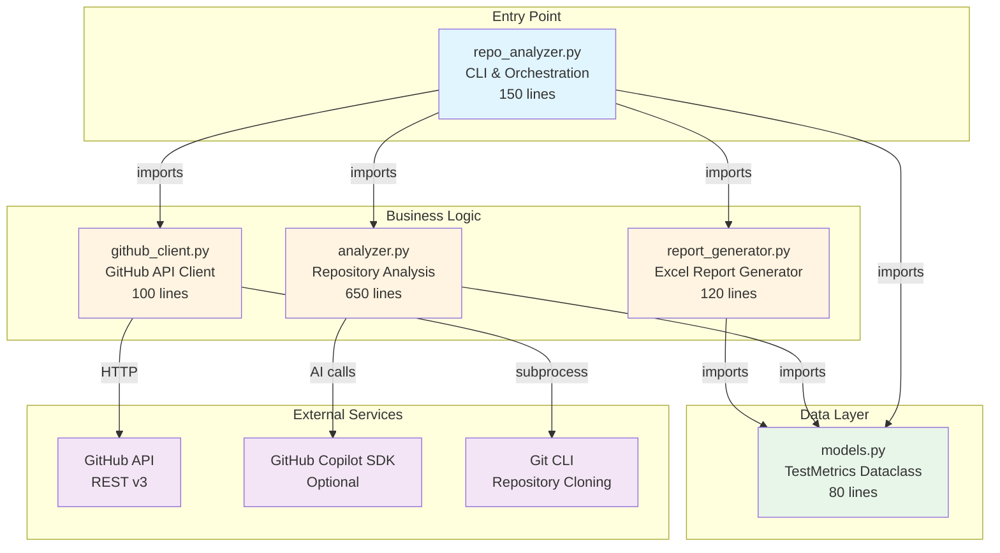

# Repository Analyzer - Architecture Diagram

## Module Dependencies (Bottom-Up)

### Level 1: Data Models (No Dependencies)
- **models.py**: Pure data structures, no external dependencies

### Level 2: External Service Clients
- **github_client.py**: Depends on GitHub API (via `requests`)
- Depends on `models.py` for data structures

### Level 3: Business Logic
- **analyzer.py**: Core analysis logic
  - Depends on `models.py`
  - Optional dependency on GitHub Copilot SDK
  - Uses git CLI via subprocess
  
- **report_generator.py**: Report generation
  - Depends on `models.py`
  - Uses pandas + openpyxl

### Level 4: Application Entry Point
- **repo_analyzer.py**: CLI orchestration
  - Imports all other modules
  - No exports (this is the entry point)

## Dataflow

```
User CLI Command
    ↓
repo_analyzer.py (main)
    ↓
┌───────────────┴──────────────┐
│                              │
github_client.py          analyzer.py
    ↓                          ↓
Clone Repos              Analyze Tests
    ↓                          ↓
    └──────────→ TestMetrics ←─┘
                      ↓
              report_generator.py
                      ↓
              Excel Report (.xlsx)
```

## Module Interaction Example

### Initialization Flow:
1. User runs: `python3 -m src.repo_analyzer --init --user myusername`
2. `repo_analyzer.main()` parses arguments
3. Creates `GitHubClient()`
4. Calls `github_client.list_user_repos()`
5. GitHub API returns repository list
6. Creates `repo_list.json` config file

### Analysis Flow:
1. User runs: `python3 -m src.repo_analyzer`
2. `repo_analyzer.main()` reads `repo_list.json`
3. For each repository:
   - `github_client.clone_repo()` → temp directory
   - `analyzer.analyze_repository()` → TestMetrics object
   - TestMetrics added to list
4. `report_generator.generate_report()` → Excel file

## Extensibility Points

### Adding New Features:

#### New Language Support
```python
# In analyzer.py
def _detect_languages(self, repo_path: Path):
    # Add detection logic
    if list(repo_path.rglob("*.rs")):
        languages.append("Rust")
```

#### New Report Format
```python
# Create new module: json_generator.py
class JSONReportGenerator:
    def generate_report(self, metrics_list, output_file):
        # JSON export logic
```

#### New Metric Collection
```python
# In models.py
@dataclass
class TestMetrics:
    # Add new field
    mutation_test_score: float = 0.0

# In analyzer.py
async def _calculate_mutation_score(self, repo_path, metrics):
    # Analysis logic
    metrics.mutation_test_score = score
```

## Testing Strategy

### Unit Tests (Per Module)

```python
# tests/test_models.py
def test_test_metrics_initialization():
    metrics = TestMetrics(...)
    assert metrics.to_dict() contains expected keys

# tests/test_github_client.py
@patch('requests.get')
def test_list_repos(mock_get):
    # Test API calls with mocked responses

# tests/test_analyzer.py
def test_language_detection(tmp_path):
    # Test with temporary file structure

# tests/test_report_generator.py
def test_excel_generation(tmp_path):
    # Test Excel creation with sample data
```

### Integration Tests

```python
# tests/test_integration.py
def test_full_analysis_workflow():
    # End-to-end test with small test repository
```

## Performance Characteristics

- **GitHub API**: Paginated (100 repos/request), rate-limited
- **Git Cloning**: Shallow clone (`--depth 1`), parallelizable
- **Analysis**: Async, can process multiple repos concurrently
- **Copilot API**: Batched (10 files/request), optional fallback
- **Report Generation**: In-memory, fast with pandas + openpyxl

## Error Handling Strategy

```
┌─────────────────────────────────────────┐
│ repo_analyzer.py (Top Level)           │
│ - Catches all exceptions                │
│ - Marks failed repos in report          │
│ - Continues with remaining repos        │
└──────────────┬──────────────────────────┘
               │
    ┌──────────┴──────────┬────────────────────┐
    ↓                     ↓                    ↓
github_client.py    analyzer.py        report_generator.py
- API errors        - Analysis errors   - Export errors
- Clone failures    - Copilot fallback  - Validation errors
- Timeout handling  - Pattern matching  - Format errors
```

Each module handles its own errors gracefully, propagating only critical failures.

## Advantages of This Architecture

### 1. **Loose Coupling**
- Modules can be used independently
- Easy to swap implementations (e.g., different report formats)

### 2. **High Cohesion**
- Each module contains related functionality
- Clear boundaries between concerns

### 3. **Testability**
- Mock external dependencies easily
- Test each module in isolation

### 4. **Maintainability**
- Know exactly where to look for bugs
- Changes localized to specific modules

### 5. **Extensibility**
- Add new features without touching existing code
- Plugin-like architecture for new capabilities
