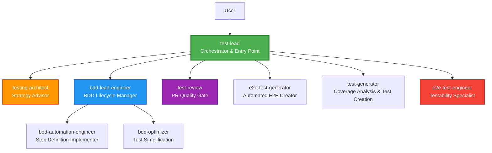
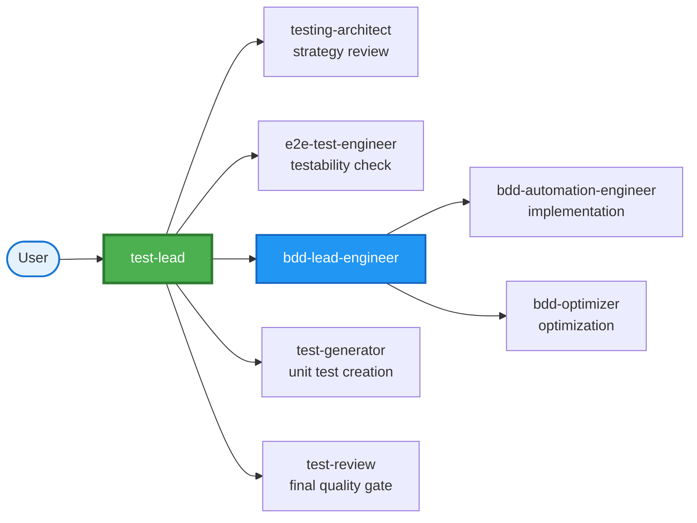
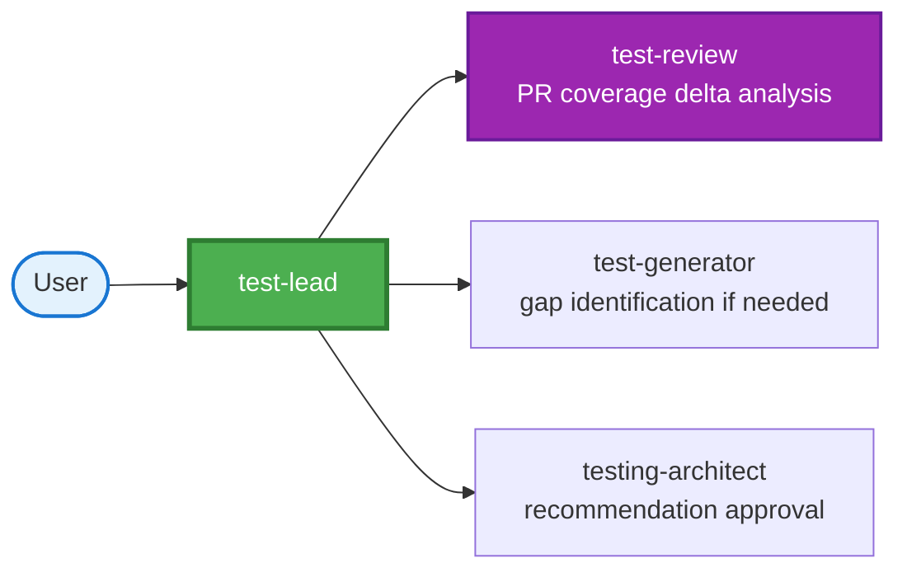
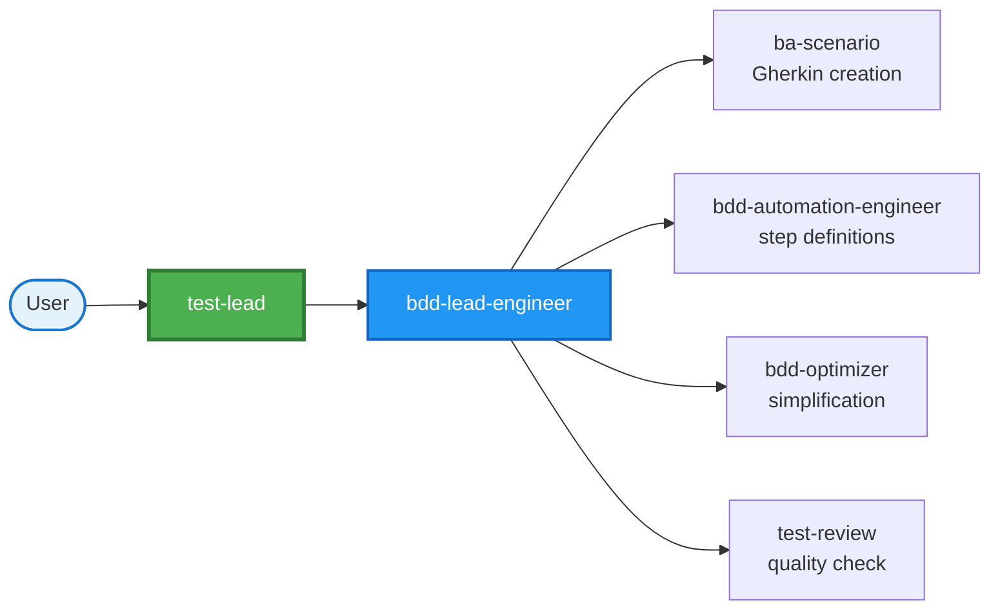
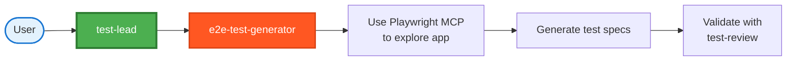
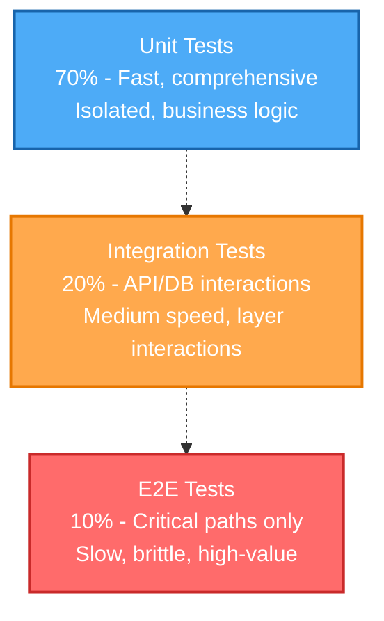

## Testing Agent Ecosystem Explained

Your workspace has a **comprehensive testing agent system** with 9 specialized agents organized in a clear hierarchy. Here's the complete breakdown:

---

## **Hierarchy & Organization**

---

## **The 9 Testing Agents**

### **1. test-lead** - Orchestrator & Entry Point
**Role:** Senior Test Lead coordinating all testing activities  
**When to use:** Start here for ANY testing request  
**Key responsibilities:**
- Creates comprehensive test plans
- Delegates to specialist agents
- Tracks progress and quality gates
- Applies KISS/YAGNI principles to testing
- Reports outcomes and metrics

**Philosophy:** Plan/Handoff approach - breaks down work, delegates, monitors, verifies

---

### **2. testing-architect** - Strategy Advisor
**Role:** Test strategy expert designing frameworks and coverage goals  
**Reports to:** test-lead  
**Key responsibilities:**
- Defines test pyramid balance (70% unit, 20% integration, 10% E2E)
- Sets coverage targets (80%+ for business logic)
- Recommends frameworks (Jest, pytest, Playwright)
- Designs mutation testing strategy
- Validates test strategy decisions

**Expertise:**
- BDD + TDD + E2E integration
- Test framework selection
- Quality gate definitions
- Coverage analysis (line, branch, mutation)

---

### **3. e2e-test-engineer** - Testability Specialist ⭐ NEW
**Role:** Code review for testability and test infrastructure architect  
**Reports to:** test-lead  
**Key responsibilities:**
- Reviews code for testability blockers
- Refactors hard-to-test code (dependency injection, SOLID principles)
- Designs mocking strategies
- Builds test fixtures, factories, helpers
- Ensures test code quality

**What they identify:**
- ❌ Business logic coupled to frameworks
- ❌ Hard-coded external dependencies
- ❌ Complex constructors
- ❌ No abstraction for data access
- ✅ Suggests refactoring with pragmatism (KISS/YAGNI)

**Mocking Philosophy:**
- Mock external APIs, databases (for unit tests), file system
- DON'T mock internal business logic or simple utilities
- Prefer integration tests over excessive mocking

---

### **4. test-generator** - Coverage Analysis & Test Creation Specialist ⭐ ENHANCED
**Role:** Analyzes coverage with risk-based prioritization and generates tests  
**Reports to:** test-lead  
**Key responsibilities:**
- Scans codebase to discover existing tests and measure coverage
- Identifies untested code paths with risk assessment
- Prioritizes gaps by severity (Critical/High/Medium/Low)
- Generates pytest, Jest, Playwright tests
- Creates BDD scenarios in Gherkin format
- Produces coverage analysis reports with effort estimates
- Follows project conventions

**Unique capabilities:**
- Risk-based prioritization (business impact, defect history, complexity)
- Coverage analysis reports (line/branch/function coverage)
- Effort estimation for test implementation
- Both strategic analysis and tactical test generation

**Replaces:** Previous test-analysis agent (consolidated for efficiency)

---

### **5. bdd-lead-engineer** - BDD Lifecycle Manager
**Role:** Orchestrates complete BDD workflow  
**Reports to:** test-lead  
**Key responsibilities:**
- Coordinates scenario creation through implementation
- Delegates to BDD specialists
- Executes test suites
- Generates coverage reports
- Manages test optimization

**Workflow:**
1. Requirements → Scenarios (with @ba-scenario)
2. Scenarios → Automation (with @bdd-automation-engineer)
3. Execute & report coverage
4. Optimize (with @bdd-optimizer)

---

### **6. bdd-automation-engineer** - Step Definition Implementer
**Role:** Implements Gherkin step definitions  
**Reports to:** bdd-lead-engineer  
**Tech Stack:**
- Frontend: TypeScript + Playwright + @cucumber/cucumber
- Backend: Python + pytest-bdd

**Key responsibilities:**
- Writes step definitions for Given/When/Then
- Builds Page Object Models
- Implements test fixtures
- Ensures test reliability and performance
- Uses parameterized steps

**Patterns they follow:**
- Cucumber expressions for type-safe parameters
- Page Object Model for maintainability
- Reusable step definitions
- Proper async handling

---

### **7. bdd-optimizer** - Test Simplification Specialist
**Role:** Reviews and optimizes BDD tests  
**Reports to:** bdd-lead-engineer  
**Key responsibilities:**
- Converts hardcoded scenarios to data-driven (Scenario Outlines)
- Eliminates duplicate step definitions
- Promotes fixture reuse
- Ensures test maintainability
- Validates KISS/YAGNI in tests

**Optimization patterns:**
- ✅ Scenario Outlines with Examples tables
- ✅ Parameterized step definitions
- ✅ Reusable fixtures
- ❌ Removes duplicate scenarios
- ❌ Eliminates hardcoded test data

---

### **8. e2e-test-generator** - Automated E2E Test Creator
**Role:** Generates E2E tests using Playwright MCP tools  
**Reports to:** test-lead  
**Key responsibilities:**
- Explores live applications via browser automation
- Identifies test scenarios from UI interactions
- Creates test specifications following project patterns
- Validates test quality
- Uses semantic selectors (roles, labels, test-ids)

**MCP Tools Available:**
- Browser navigation, clicking, form filling
- Screenshot capture
- Console log monitoring
- Network request tracking

**Best Practices:**
- Use semantic selectors (NOT xpath)
- Proper waiting (NOT fixed sleeps)
- Test user-visible behavior
- Independent, isolated tests
- Page Object Models for complex pages

---

### **9. test-review** - PR Quality Gate Specialist
**Role:** Reviews PRs for test quality and coverage  
**Reports to:** test-lead  
**Scope:** PR-specific testing review (not codebase-wide analysis)  
**Key responsibilities:**
- Analyzes coverage deltas (before/after PR changes)
- Identifies untested code paths introduced by PR
- Assesses test quality and stability of new tests
- Recommends additional scenarios for PR
- Provides merge recommendations (APPROVE/CONDITIONAL/REJECT)

**Analysis includes:**
- Coverage impact of PR
- Missing edge cases in new code
- Test stability (flakiness)
- Performance impact on CI/CD
- Risk assessment for merge

**Scope distinction:** For codebase-wide coverage analysis, use **@test-generator**. test-review focuses on PR-level quality gates.

---

## **Typical Workflows**

### **Workflow 1: New Feature Testing**

### **Workflow 2: PR Test Quality Review**

### **Workflow 3: BDD Scenario Implementation**

### **Workflow 4: E2E Test Generation from Live App**

---

## **Key Principles Across All Agents**

### **KISS/YAGNI for Testing**
- 80%+ coverage (not 100%)
- Test business logic (not getters/setters)
- Fast tests (unit > integration > E2E)
- No premature optimization
- Pragmatic mocking

### **Test Pyramid**

### **Quality Standards**
- BDD scenarios in Gherkin (Given/When/Then)
- Async patterns for async code
- Mutation testing for critical modules (80%+)
- No flaky tests
- Test code follows same quality as production code

---

## **When to Use Which Agent**

| Need | Agent | Why |
|------|-------|-----|
| Any testing request | **test-lead** | Entry point that plans & delegates |
| Test strategy decision | **testing-architect** | Framework/coverage expert |
| Code hard to test | **e2e-test-engineer** | Refactoring & testability |
| Need coverage analysis | **test-generator** | Analyzes coverage with risk prioritization |
| Need more tests | **test-generator** | Generates tests following conventions |
| BDD implementation | **bdd-lead-engineer** | Orchestrates BDD workflow |
| Step definitions | **bdd-automation-engineer** | Implements Gherkin steps |
| Tests too complex | **bdd-optimizer** | Simplifies & parameterizes |
| E2E from live app | **e2e-test-generator** | Playwright MCP exploration |
| PR review | **test-review** | PR-specific coverage & quality gate |

---

**Golden Rule:** Always start with **@test-lead** - they will orchestrate the right specialists for your specific testing needs! 🎯